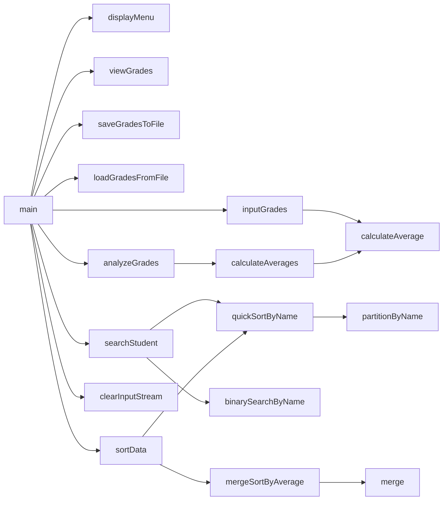

# Chapter 8 Team Project
Jacob Losey, alex D. goat

## Chapter 8 Team Project Description

### Chapter 8 Team Project Flowchart

#### Function Diagrams

| `main`    |               |  jacob    |
| ------------------ | ------------- | ------------ |
| accepts no arguements    | it runs the functions |   it outputs nothing           |
***
