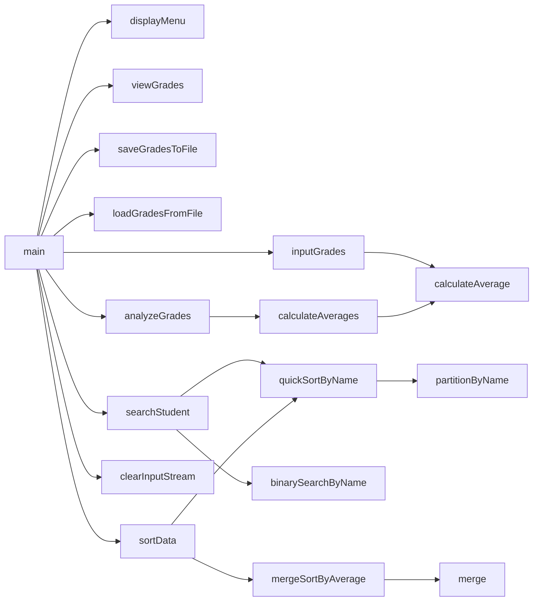

# Chapter 8 Team Project
Jacob Losey, alex D. goat

## Chapter 8 Team Project Description

### Chapter 8 Team Project Flowchart

#### Function Diagrams

| `main`    |               |  jacob    |
| ------------------ | ------------- | ------------ |
| accepts no arguements    | it runs the functions |   it outputs nothing           |
***
| `display menu`    |               |  jacob    |
| ------------------ | ------------- | ------------ |
| accepts no arguements    | it prints the menu |   it outputs menu   |
***
| `input grades`    |               |  jacob    |
| ------------------ | ------------- | ------------ |
| accepts nothing    | it takes grade and names |   it outputs nothing  |
***
| `view grades`    |               |  jacob    |
| ------------------ | ------------- | ------------ |
| accepts no arguements    | prints the gades of the students |   outputs grades    |
***
| `save`    |               |  max    |
| ------------------ | ------------- | ------------ |
| accepts no arguements    | saves the grades and names to a file |   it outputs nothing    |
***
| `load`    |               |  max    |
| ------------------ | ------------- | ------------ |
| accepts no arguements    | prints the saved grades from the file |   it outputs saved grades    |
***
| `anilize grades`    |               |  max    |
| ------------------ | ------------- | ------------ |
| accepts no arguements    | finds the highest,lowest, and avi of the grades |   it outputs min,max,avi           |
***
| `search student`    |               |  jacob    |
| ------------------ | ------------- | ------------ |
| accepts no arguements    | searches for a serten student's grades |   it outputs the student's grades           |
***
| `sort data`    |               |  max    |
| ------------------ | ------------- | ------------ |
| accepts no arguements    | it runs the functions |   it outputs nothing           |
***
| `clear inputs`    |               |  max    |
| ------------------ | ------------- | ------------ |
| accepts no arguements    | it runs the functions |   it outputs nothing           |
***
